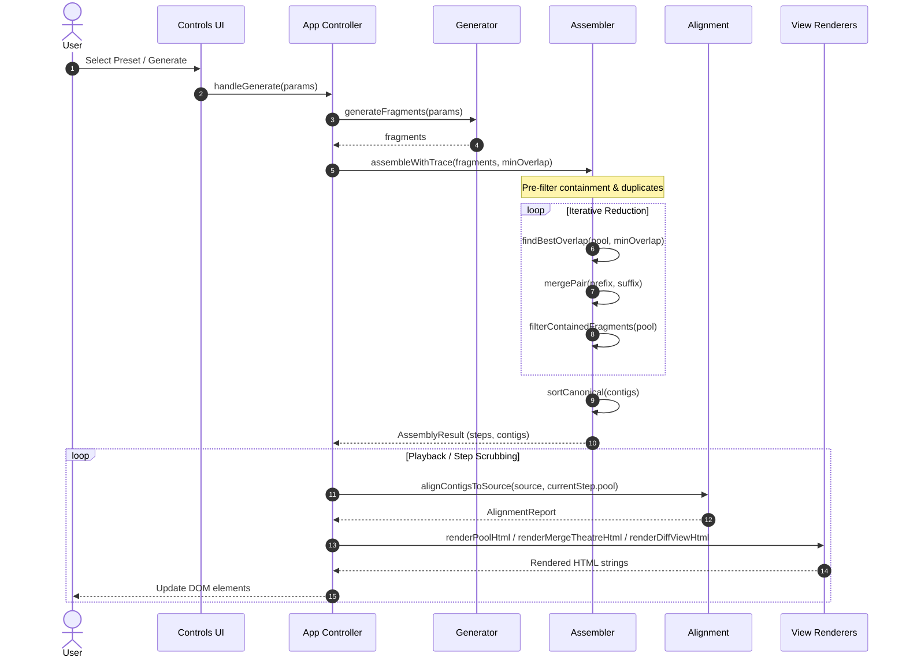

# Reconstruct Strings Web

This project provides an interactive web-based animation for the
Overlap-Layout-Consensus (OLC) sequence assembler. It visually demonstrates how
string fragments assemble into contiguous sequences (contigs) and dynamically
verifies reconstruction against a reference sequence.

## Features

- **Stepwise OLC Animation:** Step through pairwise suffix-prefix overlaps,
  merges, and dynamic containment filtering.
- **Dynamic Reference Verification:** Real-time alignment against ground-truth
  sequences with coverage percentage and chimera detection.
- **Configurable Generator & Presets:** Built-in biological sequence presets
  with custom fragment pool inputs.
- **Zero Runtime Dependencies:** Compiles into a self-contained, single-file
  HTML bundle using vanilla TypeScript and CSS.

## Architecture & Workflow

The reconstruction animation pipeline coordinates fragment generation,
iterative reduction assembly, and real-time reference verification:



## Quick Start

### Prerequisites

- Node.js (>= 18.19.0 recommended, or 20+)
- npm (Node Package Manager)

### Installation

Install the project dependencies using `make` (or `npm`):

```bash
make install
# or
npm install
```

### Build & Run

Build the self-contained HTML bundle:

```bash
make build
```

Open the generated application in your web browser:

```bash
xdg-open dist/index.html
# or
open dist/index.html
```

Alternatively, serve the built application locally using the bundled Node
server:

```bash
npm run serve
# or
make serve
```

By default, this serves `dist/` on port 8080 (configurable via the `PORT`
environment variable).

### URL Parameters

The application supports URL query parameters for deep linking:

- `?preset=<index>`: Load a specific preset configuration on startup (0-indexed).
- `?step=<index>`: Jump to a specific animation step.

## Assembly Mechanics

### Generator Parameters

The fragment generator supports the following bounds:

- `minOverlap` (n): Minimum suffix-prefix overlap to qualify for merging (>= 2).
- `minLength` (a): Minimum length of generated fragments (>= 2).
- `maxLength` (b): Maximum length of generated fragments (>= a).
- `fragmentCount` (m): Total number of fragments to sample from the source.

The application enforces limits to prevent denial-of-service in the O(k²·L²)
assembly step:

- Maximum source length: 10,000 characters.
- Maximum fragment count: 500 fragments.

### Haskell Parity

This implementation ensures deterministic parity with the Haskell reference
implementation of `reconstruct-strings`, relying on strict tie-breaking rules:

1. **Longest Overlap Match:** Prefers candidates with the highest `matchLength`.
2. **Code Unit Order (Prefix):** Tie-breaks on the prefix fragment lexicographically using code unit order.
3. **Code Unit Order (Suffix):** Tie-breaks on the suffix fragment lexicographically using code unit order.

## Development Pipeline

Run the default pipeline (static checks, build bundle, and test suite):

```bash
make
```

Available development targets:

- **`make all`:** Runs `install`, `check`, `build`, and `test` sequentially.
- **`make check`:** Alias for running static type checks and linting.
- **`make typecheck`:** Validates TypeScript types without emitting output.
- **`make test`:** Executes the full unit and view test suite.
- **`make build`:** Generates the standalone HTML bundle using esbuild.
- **`make clean`:** Removes compiled distribution artefacts (`dist/`).
- **`make cleanall`:** Purges `dist/` and `node_modules/`.

## Project Structure

- `src/`: TypeScript source code.
  - `alignment.ts`: Real-time contig alignment verification.
  - `assembler.ts`: The core OLC iterative reduction assembler.
  - `generator.ts`: Fragment sampling logic and parameter validation.
  - `main.ts`: Application controller wiring UI to domain logic.
  - `presets.ts`: Built-in sequence presets.
  - `types.ts`: Core domain interfaces.
  - `ui/`: Pure HTML template renderers for DOM views.
- `static/index.html`: Base HTML template.
- `dist/`: Generated standalone distribution bundle.
- `test/`: Automated test suite (assembler, generator, alignment, views).
- `build.mjs`: Standalone esbuild script.
- `.github/workflows/pages.yml`: Automated deployment to GitHub Pages.

## License

This project is licensed under the BSD-3-Clause licence. See the
[LICENSE](LICENSE) file for details.
