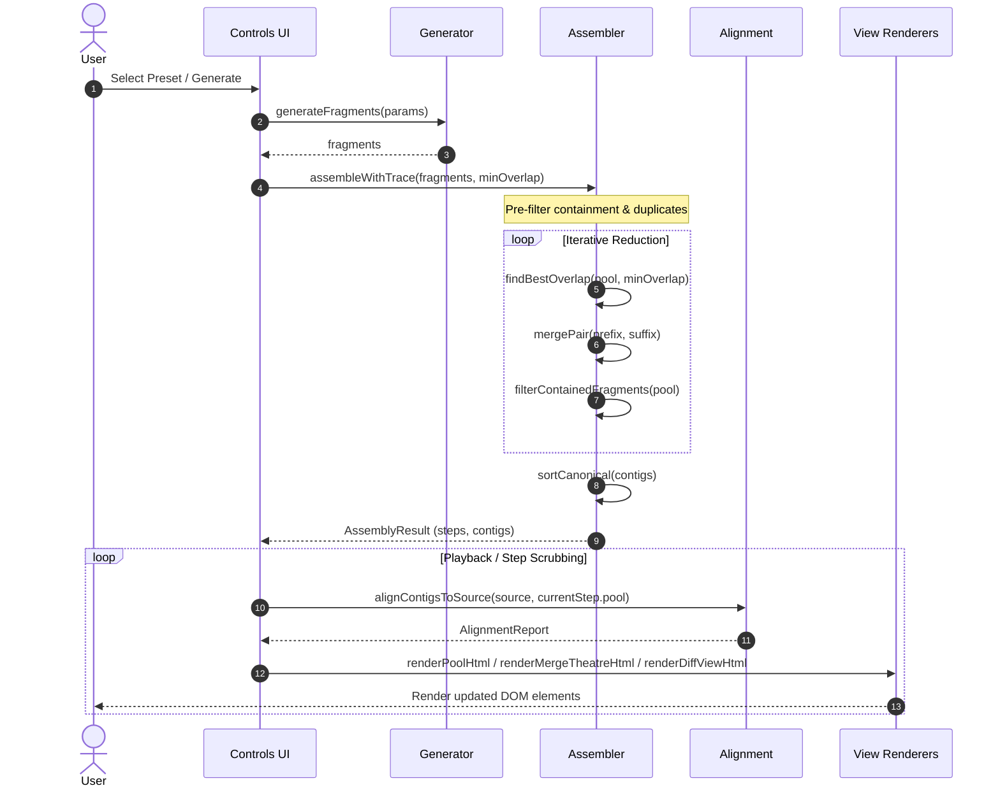

# Reconstruct Strings Web

This project provides an interactive web-based animation for the
Overlap-Layout-Consensus (OLC) sequence assembler. It visually demonstrates how
string fragments assemble into contiguous sequences (contigs) and dynamically
verifies reconstruction against a reference sequence.

## Features

- **Stepwise OLC Animation:** Step through pairwise suffix-prefix overlaps,
  merges, and dynamic containment filtering.
- **Dynamic Reference Verification:** Real-time alignment against ground-truth
  sequences with coverage percentage and chimera detection.
- **Configurable Generator & Presets:** Built-in biological sequence presets
  with custom fragment pool inputs.
- **Zero Runtime Dependencies:** Compiles into a self-contained, single-file
  HTML bundle using vanilla TypeScript and CSS.

## Architecture & Workflow

The reconstruction animation pipeline coordinates fragment generation,
iterative reduction assembly, and real-time reference verification:



## Quick Start

### Prerequisites

- Node.js (>= 18 recommended)
- npm (Node Package Manager)

### Installation

Install the project dependencies using `make` (or `npm`):

```bash
make install
# or
npm install
```

### Build & Run

Build the self-contained HTML bundle:

```bash
make build
```

Open the generated application in your web browser:

```bash
xdg-open dist/index.html
# or
open dist/index.html
```

Alternatively, serve the `dist/` directory with any local HTTP server:

```bash
python3 -m http.server 8080 --directory dist
```

### Development Pipeline

Run the default pipeline (static checks, build bundle, and test suite):

```bash
make
```

Individual development targets:

- **Typecheck:** Validates TypeScript types without emitting output.

  ```bash
  make typecheck
  # or
  npm run typecheck
  ```

- **Test:** Executes the full unit and view test suite.

  ```bash
  make test
  # or
  npm run test
  ```

- **Clean:** Removes compiled distribution artefacts.

  ```bash
  make clean
  ```

Run `make help` to inspect all available targets.

## Project Structure

- `src/`: TypeScript source code and view templates.
- `src/ui/`: Pure declarative view templates and controls.
- `static/`: HTML template wrapper.
- `dist/`: Generated standalone distribution bundle
  ([index.html](dist/index.html)).
- `test/`: Automated test suite (assembler, generator, alignment, views).
- `build.mjs`: Standalone inlining build script utilising `esbuild`.

## License

This project is licensed under the BSD-3-Clause licence. See the
[LICENSE](LICENSE) file for details.
