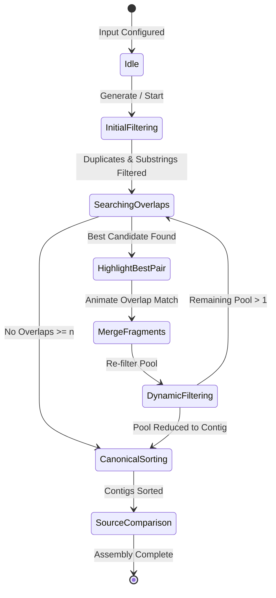

# Interactive OLC Assembler Animation Specification (REQ-001)

[← Back to Documentation Index](README.md)

## 1. Overview and Problem Statement

This specification defines the functional requirements, user interface,
animation state machine, and architecture for an interactive web application
that animates the reconstruction of random fragments using the
Overlap-Layout-Consensus (OLC) greedy reduction protocol.

The application serves as both an educational visualisation tool and an
interactive verification workbench for the sequence assembly algorithms
implemented in [`src/assembler.ts`][src-assembler] and the synthetic fragment
generator in [`src/generator.ts`][src-generator].

Given an underlying source sequence and generation parameters, the application:

1. synthesises random overlapping fragments from the source text,
2. animates the stepwise greedy assembly process in the browser,
3. highlights matching suffix-prefix overlaps with distinct colour coding,
4. and aligns the resulting contigs against the original source of truth,
   clearly identifying matches, missing coverage gaps, and chimeric errors.

The delivered application is a self-contained, standalone HTML document
requiring no external runtime servers, remote CDN dependencies, or network
connectivity.

## 2. Scope and Non-Goals

### 2.1 In Scope

- Random fragment generation from arbitrary source strings based on user
  parameters (`source`, `n`, `a`, `b`, `m`).
- Manual editing of generated fragments and custom fragment pool inputs.
- Faithful client-side execution of the deterministic greedy overlap
  reduction algorithm.
- Interactive playback controls: Play, Pause, Step Forward, Step Backward,
  Reset, and animation speed adjustment.
- Visual animation showing pairwise overlap testing, tie-breaking, magnetic
  fragment merging, and dynamic containment elimination.
- Colour-coded overlap regions highlighting shared character subsequences.
- Stacked reference alignment comparing assembled contigs against the source
  sequence, highlighting exact matches, mismatches, and uncovered gaps.
- Curated presets demonstrating nucleotide sequences, alphabet examples, and
  text pangrams.
- Packaging as a single standalone HTML artefact (`dist/index.html`) via the
  `make build` Makefile target.

### 2.2 Non-Goals

- Heuristic error-tolerant or fuzzy alignment during assembly (the assembly
  algorithm requires exact character matches).
- Reverse complement handling (single-stranded forward assembly only).
- Server-side compute or backend database persistence.

## 3. Mathematical and Input Model

### 3.1 Input Parameters

The generation interface accepts five user-configurable parameters:

1. **`source`** (String): The original ground-truth sequence. Must be
   non-empty (length $L \ge 1$).
2. **`n`** (Positive Integer, $n \ge 2$): The minimum overlap threshold. A
   candidate overlap between two fragments is valid if and only if its length
   $k \ge n$.
3. **`a`** (Positive Integer, $a \ge 2$): The minimum fragment length. Must
   satisfy $a \le L$.
4. **`b`** (Positive Integer, $b \ge a$): The maximum fragment length. Must
   satisfy $b \le L$.
5. **`m`** (Positive Integer, $m \ge 2$): The number of synthetic fragments to
   generate from `source`.

### 3.2 Synthetic Fragment Generation

Given valid parameters $(source, n, a, b, m)$, the generator extracts $m$
random substrings as follows:

For each index $i \in \{1, \dots, m\}$:

1. Sample fragment length $\ell_i$ uniformly at random from the discrete
   interval $[a, b]$:
   $$\ell_i \sim \text{Uniform}(\{a, a+1, \dots, b\})$$
2. Sample start offset $o_i$ uniformly at random such that the fragment is
   fully contained within `source`:
   $$o_i \sim \text{Uniform}(\{0, 1, \dots, |source| - \ell_i\})$$
3. Extract the substring $F_i = source[o_i : o_i + \ell_i]$.

The resulting multiset $\{F_1, F_2, \dots, F_m\}$ forms the raw input pool.

### 3.3 Presets

The interface provides at least three instant-load presets:

- **DNA Sequence**:
  - `source`: `ATGGCGTGCA`
  - $n = 2$, $a = 4$, $b = 6$, $m = 6$
- **Alphabet Sequence**:
  - `source`: `ABCDEFGHIJK`
  - $n = 2$, $a = 3$, $b = 5$, $m = 6$
- **English Pangram**:
  - `source`: `THE QUICK BROWN FOX JUMPS OVER THE LAZY DOG`
  - $n = 3$, $a = 8$, $b = 15$, $m = 12$

## 4. Assembly Reduction Semantics

The client-side assembler strictly adheres to total functional reduction
semantics:

1. **Pre-processing Deduplication & Containment Filtering:**
   - Duplicate fragments are collapsed to a single representative.
   - Any fragment that is a proper substring of another fragment in the pool is
     eliminated.
2. **Candidate Overlap Calculation:**
   - Suffix of $F_p$ matches prefix of $F_s$ with length $k \ge n$.
   - Overlap must be strictly shorter than $\max(|F_p|, |F_s|)$.
3. **Deterministic Tie-Breaking:**
   - Primary: Longest match length $k$ (descending).
   - Secondary: Smaller prefix fragment $F_p$ in code unit order (ascending).
   - Tertiary: Smaller suffix fragment $F_s$ in code unit order (ascending).
4. **Merge Operation:**
   - Concatenate $F_p$ with the non-overlapping remainder of $F_s$:
     $$merged = F_p \mathbin{+} F_s[k:]$$
5. **Dynamic Containment Elimination:**
   - Any surviving fragment in the pool that is a proper substring of $merged$
     is eliminated.
6. **Canonical Contig Sorting:**
   - Final contigs are sorted descending by length, then ascending by code unit
     order.

## 5. Animation State Machine and Visual Design

### 5.1 Stepwise State Machine

The assembly process is pre-computed into an immutable list of discrete
animation frames (steps) that the user can traverse forward or backward:



Each step record encapsulates:

- `stepIndex`: Sequential step number.
- `stepType`: One of `init`, `filter-initial`, `find-overlap`, `merge-pair`,
  `filter-dynamic`, `canonical-sort`, `completed`.
- `pool`: The active list of fragments/contigs at this point.
- `candidate`: The prefix, suffix, and match length (if applicable).
- `removedFragments`: Any fragments eliminated due to containment in this step.
- `description`: Plain English description of the action taken.

### 5.2 Visual Components and Layout

The application viewport is organised into four clean panels:

1. **Control and Parameter Bar (Top):**
   - Inputs for `source`, `n`, `a`, `b`, and `m`.
   - Preset dropdown / buttons.
   - Action buttons: "Generate Fragments", "Load Preset", "Reset".
   - Playback controls: Play (▶), Pause (⏸), Step Forward (⏭), Step
     Backward (⏮), Speed Slider (0.25× to 4×), and Step Progress Indicator.
2. **Fragment Pool Workspace (Middle-Top):**
   - Renders each fragment as a card or pill block displaying its sequence.
   - Fades out contained or duplicate fragments with a dissolve transition.
   - Highlights the winning prefix fragment and suffix fragment during merges.
3. **Merge and Overlap Theatre (Middle-Bottom):**
   - Isolates the two merging fragments.
   - Slides them horizontally so their overlapping characters align vertically.
   - Displays overlapping characters with an accented green/blue background and
     connecting lines.
   - Fuses them into the resulting merged sequence.
4. **Source Alignment and Verification Panel (Bottom):**
   - Displays the original `source` string on the top line.
   - Displays the assembled contig(s) underneath.
   - Colourises matched characters (green), mismatches (red), and uncovered
     regions (grey dashed boxes).
   - Metrics summary: Sequence Coverage %, Number of Assembled Contigs, and
     Exact Match status.

## 6. Verification and Error Reporting

When assembly completes, the assembled contigs are compared against `source`:

1. **Global/Local Identity Check:**
   - If a single contig is produced and equals `source`, mark as:
     `PERFECT RECONSTRUCTION (100% Identity)`.
2. **Coverage Gap Reporting:**
   - If multiple disjoint contigs are produced, locate the maximal matching
     subsequences of each contig within `source`.
   - Highlight the uncovered source spans as coverage gaps caused by
     insufficient fragment count ($m$) or excessive minimum overlap ($n$).
3. **Misassembly Detection:**
   - If an assembled contig cannot be mapped to a contiguous substring of
     `source`, flag it as a chimeric join resulting from repeat ambiguity.

## 7. Technical Architecture and Packaging

### 7.1 Tech Stack

- **Language:** TypeScript (strict mode, no implicit any).
- **DOM / UI:** Modern semantic HTML5, pure CSS3 (flexbox/grid, CSS transitions
  and animations, responsive layout).
- **Bundler:** `esbuild` via `build.mjs`, compiling TypeScript (`src/main.ts`),
  CSS (`src/ui/styles.css`), and HTML (`static/index.html`) into a single
  standalone `dist/index.html` file.
- **Dependencies:** Zero external runtime dependencies. The compiled HTML file
  operates completely offline.

### 7.2 Directory Structure

```text
reconstruct-strings-web/
├── src/
│   ├── types.ts          # Core domain models and state machine types
│   ├── generator.ts      # Random fragment extraction from source
│   ├── assembler.ts      # Pure greedy overlap algorithm
│   ├── alignment.ts      # Source comparison and error diffing
│   ├── presets.ts        # Calibrated preset configurations
│   ├── input.ts          # Input parsing and validation
│   ├── ui/
│   │   ├── controls.ts   # Parameter inputs and playback buttons
│   │   ├── poolView.ts   # Workspace rendering for active fragment cards
│   │   ├── mergeView.ts  # Overlap sliding and merging animation
│   │   ├── diffView.ts   # Stacked source alignment view
│   │   ├── stepDetails.ts# Step explanation and details card
│   │   ├── escape.ts     # HTML entity escaping helper
│   │   └── styles.css    # UI styling
│   └── main.ts           # Application entry point and orchestrator
├── static/
│   └── index.html        # HTML template and layout container
├── test/                 # Automated test suite
├── build.mjs             # Standalone esbuild bundler script
├── serve.mjs             # Local development HTTP server
├── package.json          # Node scripts and development dependencies
├── tsconfig.json         # Strict TypeScript compiler options
├── Makefile              # Project workflow targets
└── dist/
    └── index.html        # Standalone compiled deliverable
```

### 7.3 Build Integration

A target `make build` in the project `Makefile` orchestrates compilation:

```makefile
.PHONY: build
build: $(SRCS) ## Build project bundle
	@echo build ...
	@npm run build
```

## 8. Architectural Decisions

### ADR-1: Standalone Single-File Web Artefact

- **Context:** The animation needs to be easily run and shared by users without
  requiring local server setups, backend daemons, or separate runtimes.
- **Decision:** Bundle the entire TypeScript application, styling, and markup
  into a single self-contained `dist/index.html` file.
- **Consequence:** Users can open the file directly in any modern web browser
  (`file:///...`) or host it on static web servers (such as GitHub Pages) with
  zero configuration.

### ADR-2: Deterministic Greedy Overlap Reduction

- **Context:** The assembly visualisation requires total determinism without
  race conditions or ambiguity when evaluating overlapping fragments.
- **Decision:** Implement a strict greedy overlap protocol with total
  tie-breaking in `src/assembler.ts`, ordering candidates by: (1) longest
  overlap length descending, (2) prefix fragment ascending by code unit order,
  and (3) suffix fragment ascending by code unit order, followed by dynamic
  containment elimination.
- **Consequence:** Assembly reduction is completely deterministic and
  reproducible across all platforms and execution environments.

### ADR-3: Pre-computed Discrete Animation Steps

- **Context:** Playback requires arbitrary seeking (Step Forward, Step
  Backward, Reset, Pause) without accumulating divergent animation states.
- **Decision:** Pre-compute the complete sequence of reduction steps as an
  immutable list of states upon starting or stepping through an assembly run.
- **Consequence:** Seeking forward and backward is instantaneous and
  deterministic, eliminating race conditions or out-of-sync visual glitches.

### ADR-4: Stacked Source Alignment View

- **Context:** Random fragment sampling can produce coverage gaps, chimeric
  joins, or exact matches. Users need immediate visual clarity on assembly
  fidelity.
- **Decision:** Implement a stacked alignment view below the workspace comparing
  each contig to `source`, colourising matched characters in green, mismatches
  in red, and gaps in grey.
- **Consequence:** Users can intuitively see whether reconstruction succeeded
  and diagnose parameter failures (e.g. $m$ too small or $n$ too large).

## 9. See Also

- [Documentation Index](README.md)
- [Domain Glossary](GLOSSARY.md)
- [Assembly Dynamics and Parameter Heuristics](heuristics.md)
- [Reconstructing DNA from Short Fragments][dna-doc]

[dna-doc]: reconstructing-complete-dna-strand-from-short-fragments.md
[src-assembler]: ../src/assembler.ts
[src-generator]: ../src/generator.ts
